# COLLAPSE MACHINE: Inter-Galactic Mass-Transit Operation Manual

This document outlines the standard operating procedures and the core physics pipeline for collapsing, transmitting, and re-materializing macroscopic cargo across inter-galactic distances.

---

### Phase I: Pre-Launch Preparation Protocol

The transit bay must complete the following physical and logistical sequences in exact chronological order before triggering the core transmission pipeline:

**Load Cargo** $\rightarrow$ **Seal Gate** $\rightarrow$ **Pull Vacuum** $\rightarrow$ **Send Signal** $\rightarrow$ **Receive Approval ID** $\rightarrow$ **Begin**

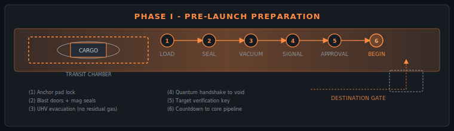

<ol class="phase1-steps">
  <li class="phase1-step">
    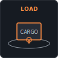
    
<strong>Load Cargo:</strong> The shipping container is locked onto the central anchor pad of the transit chamber.

  </li>
  <li class="phase1-step">
    
    
<strong>Seal Gate:</strong> Primary blast doors seal the chamber, isolate the local gravity grid, and engage heavy magnetic seals.

  </li>
  <li class="phase1-step">
    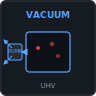
    
<strong>Pull Vacuum:</strong> Hyper-pumps evacuate all atmospheric gas to create an ultra-high vacuum (UHV). <em>Warning: Any remaining gas molecules will cause a thermonuclear-scale fusion detonation during the compression phase.</em>

  </li>
  <li class="phase1-step">
    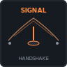
    
<strong>Send Signal:</strong> The transmitter beams a targeted quantum handshake vector across the void to sync coordinates with the destination.

  </li>
  <li class="phase1-step">
    
    
<strong>Receive Approval ID:</strong> The target station transmits a secure quantum verification key, confirming their receiver gate is online, under vacuum, and cleared to catch the incoming mass wave.

  </li>
  <li class="phase1-step">
    
    
<strong>Begin:</strong> The automated countdown reaches zero, instantly engaging the core physics pipeline.

  </li>
</ol>

---

### Phase II: The Definitive Inter-Galactic Shipping Formula

$$\hat{\rho}_0 \rightarrow (\Delta S_{^3\text{He}} \rightarrow 0) \rightarrow \vec{M} \cdot \nabla B \rightarrow \Omega_{\text{Rabi}} \rightarrow \hat{U}_{\text{Squeeze}} \rightarrow |\Psi_{\text{Planck}}\rangle \rightarrow \hat{U}_{\text{Squeeze}}^\dagger$$

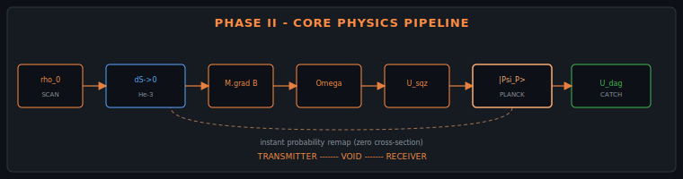

---

### Phase III: Chronological Symbol Breakdown

* **$\hat{\rho}_0$ (The Initial Density Matrix Scan)**
  The system completes a total quantum scan of the cargo. It maps every physical information profile—including mass, shape, and internal atomic states—into a master digital density matrix template.

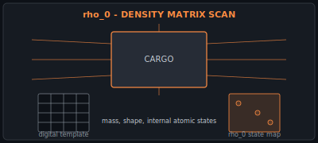

* **$\Delta S_{^3\text{He}} \rightarrow 0$ (Superfluid Entropy Evacuation)**
  The chamber floods with ultra-cold Helium-3 superfluid. This flash-quenches the cargo, stripping away all internal thermal disorder and entropy ($S$) until the molecular structure rests perfectly still at absolute zero.

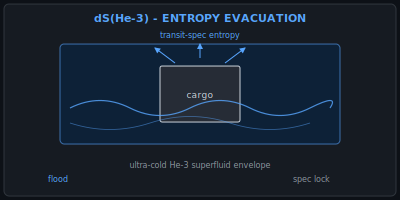

* **$\vec{M} \cdot \nabla B$ (Magnetic Field Gradient Detrapping)**
  The laboratory's active magnetic containment fields are phased out. Neutralizing the interaction between the atoms' magnetic moments ($\vec{M}$) and the external spatial field gradient ($\nabla B$) fully detaches the cargo from local gravity and spatial anchoring.

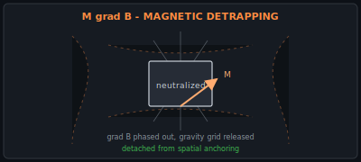

* **$\Omega_{\text{Rabi}}$ (The Rabi Frequency Synchronization)**
  Multi-axis resonant lasers fire at the cargo. Operating at the exact Rabi frequency, this optical molasses violently forces every individual subatomic particle into a perfectly synced, macroscopically coherent rhythm.

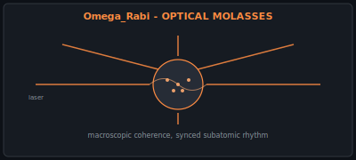

* **$\hat{U}_{\text{Squeeze}}$ (The Quantum Squeezing Operator)**
  The system activates a controlled, unitary transformation. This operator folds the dimensions of space inward, instantly imploding the cargo's physical structure without losing a single bit of information.

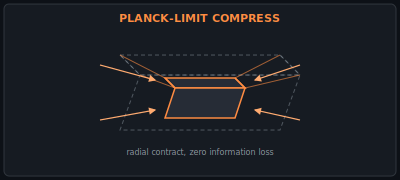

* **$|\Psi_{\text{Planck}}\rangle$ (The Planck-Scale Mass Wavefunction)**
  The cargo ceases to exist as solid matter. It becomes a hyper-dense mass wavefunction compressed down to the Planck scale. Because it has a zero scattering cross-section, it bypasses the light-speed limit and instantly remaps its probability coordinates across the universe to the receiver gate.

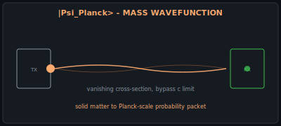

* **$\hat{U}_{\text{Squeeze}}^\dagger$ (Inverted Unitary Expansion)**
  The destination station catches the incoming wavefunction packet using the inverse squeeze operator, re-expanding the Planck-scale packet back into macroscopic matter on the receiver anchor pad.

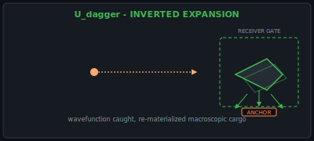
