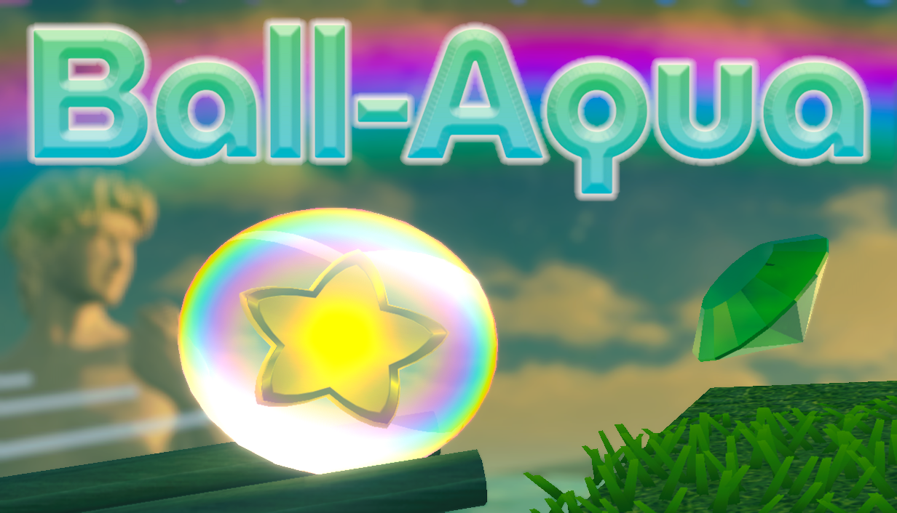
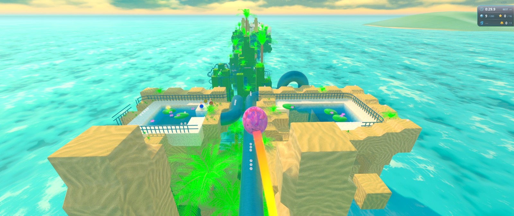
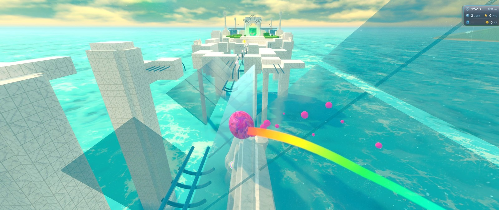
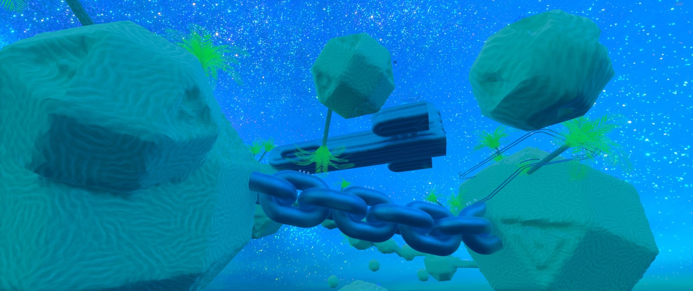

# #96 Ball-Aqua press kit

Physics ball platformer multiplayer press assets.

  <a href="https://github.com/DreamingSaints/blog/raw/main/096/ball-aqua-press-kit.zip" style="display:inline-block;padding:10px 16px;background:#1b2838;color:#fff;text-decoration:none;border-radius:6px;font-weight:600;">Download press kit (ZIP ~93.7 MB)</a>

**ZIP contents:** current official trailer, `screenshots/`, `steam/` capsules and icons, plus locked and unlocked Steam achievement icons in `achievements/`

Free for videos and posts.

Gameplay GIFs and MP4s (separate): [`096/clips` on GitHub](https://github.com/DreamingSaints/blog/tree/main/096/clips)

### Previews

Steam: https://store.steampowered.com/app/4967660/  
Demo: https://store.steampowered.com/app/5011940/

### Official trailer

The current trailer is the same version used on Steam.

<video controls preload="metadata" poster="./096/previews/screenshot-1.jpg" style="width:100%;max-width:920px;">
  <source src="./096/trailers/ball-aqua-trailer-current.mp4" type="video/mp4" />
  <a href="./096/trailers/ball-aqua-trailer-current.mp4">Download the current Ball-Aqua trailer</a>
</video>

[Download current trailer](./096/trailers/ball-aqua-trailer-current.mp4)

### Trailer history

  
25 September 2026

  <video controls preload="metadata" poster="./096/previews/screenshot-2.jpg" style="width:100%;max-width:920px;">
    <source src="./096/trailers/ball-aqua-trailer-2026-09-25.mp4" type="video/mp4" />
    <a href="./096/trailers/ball-aqua-trailer-2026-09-25.mp4">Download the 25 September 2026 trailer</a>
  </video>

  
24 September 2026

  <video controls preload="metadata" poster="./096/previews/screenshot-3.jpg" style="width:100%;max-width:920px;">
    <source src="./096/trailers/ball-aqua-trailer-2026-09-24.mp4" type="video/mp4" />
    <a href="./096/trailers/ball-aqua-trailer-2026-09-24.mp4">Download the 24 September 2026 trailer</a>
  </video>

