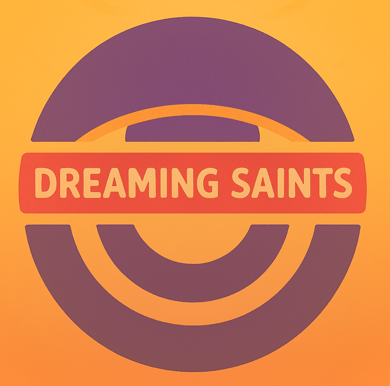
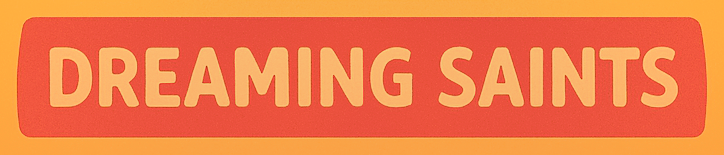

# #100 About

Inspired by BONEWORKS<a class="about-tip-title" href="https://store.steampowered.com/app/823500/">BONEWORKS</a>10 Dec 2019BONEWORKS is an Experimental Physics VR Adventure. Use found physics weapons, tools, and objects to fight across dangerous playscapes and mysterious architecture.StCost saysBest VR adventure I experienced. Physical climbing is fun, feels like cheating. Many paths to approach problems. I love entering a room, pushing doors open using gun barrels and then blasting the null bodies. Still the best VR game for me. and VR tech, we gathered a team to make RISING BONEvR<a class="about-tip-title" href="https://store.steampowered.com/app/1775350/RISING_BONEvR/">RISING BONEvR</a>demo 7 Nov 2021(First level demo available!) Physics based puzzle about climbing out of deep hell without any legsStCost saysQuite a challenge to implement VR physics similar to BONEWORKS. Learned more math, vectors, matrices. Level design is terrible, physics clunky, but gameplay was fun when it works. My first proper C# game, and fiancee StTaya helped by making her first 3D models in Blender. Some day we'll continue - we learned many new lessons since then. <small>(demo 7 Nov 2021)</small>. Now focused on our dream-game COLLAPSE MACHINE<a class="about-tip-title" href="https://store.steampowered.com/app/2980830/COLLAPSE_MACHINE">COLLAPSE MACHINE</a>since Sep 2023In COLLAPSE MACHINE - scavenge, raid, and survive a super-magnetic wasteland in co-op PvE. Hoard tesla-punk tech, mine voxel terrain, run a mobile vehicle base through shifting seasons, intercept rivals, and siege their factoriesStCost saysInitial idea was to freely walk in co-op inside the vehicle cargo hangar, while a friend drives the car over desert dunes. Solved it by hiding static colliders, while visuals render near the car. The camera sees real movement, while physics of internal objects stays stable. <small>(since Sep 2023)</small>. Quick side-projects: Whomers Ate My Lawn!<a class="about-tip-title" href="https://store.steampowered.com/app/3600250/Whomers_Ate_My_Lawn/">Whomers Ate My Lawn!</a>released 6 Apr 2025Dive into a simple yet charming world where curious Whomers creatures dig, eat, and survive in a compact 64x64 grid. This minimalistic simulation offers a peaceful experience of watching and interacting with small digital beings as they go about their livesStCost saysInspired by RimWorld, I wanted my own small semi-afk villager-manager. Made small creatures digging the lawn. You as God restore or dig more grass. Grow plants for more carrots. All to grow the population of Whomers. Made in 1 month with MonoGame in C#. <small>(released 6 Apr 2025)</small> and Ball-Aqua<a class="about-tip-title" href="https://store.steampowered.com/app/4967660/">Ball-Aqua</a>demo 20 Aug 2026Demo Launch on August 20! Roll a physics ball through tropical obstacle courses. Beat the timer, collect bubbles and stars, and chase 100% clears. Play Freeroam solo or co-op, compete in Race, build levels, and share on Steam Workshop.StCost saysI've seen many ball-rolling games recently. But all of them had terrible movement and platforms - just thin beams. I wanted to speed and jump forward, not short hops on thin platforms. That day I stumbled on the Frutiger Aero water album Alezya - Dream Island (youtube.com/watch?v=3R6beuJQkxM). Such hydrated music inspired me to make a water-themed ball-rolling multiplayer with a level editor and freedom. Spent about a month on a playable version to show as a demo. A few more months to polish and make more levels for the full release. <small>(demo 20 Aug 2026)</small>.

Meet the team and what we like

<h2 class="about-name"><a class="about-anchor" href="#stcost">StCost</a></h2><ul class="about-roles"><li>Team Lead</li><li>Software Engineer</li><li>Game Designer</li></ul>BONEWORKS<a class="about-tip-title" href="https://store.steampowered.com/app/823500/">BONEWORKS</a>10 Dec, 2019BONEWORKS is an Experimental Physics VR Adventure. Use found physics weapons, tools, and objects to fight across dangerous playscapes and mysterious architecture.2 Mello - I Wanna Kno<a class="about-tip-title" href="https://www.youtube.com/watch?v=nbogUmJkeBI">2 Mello - I Wanna Kno</a>2 Mello - I Wanna Kno from Sounds of Tokyo-To Future (2021).The Venture Bros.<a class="about-tip-title" href="https://en.wikipedia.org/wiki/The_Venture_Bros.">The Venture Bros.</a>The Venture Bros. is an American adult animated action-adventure television series created by Jackson Publick and Doc Hammer for Cartoon Network's late night programming block Adult Swim. Following a pilot episode on February 16, 2003, the series premiered on August 7, 2004. The Venture Bros.Unity<a class="about-tip-title" href="https://unity.com/">Unity</a>Real-time 3D engine used to make the studio games.

About

2011: got own PC, was TF2<a class="about-tip-title" href="https://store.steampowered.com/app/440/">TF2</a>10 Oct, 2007Nine distinct classes provide a broad range of tactical abilities and personalities. Constantly updated with new game modes, maps, equipment and, most importantly, hats! and Minecraft<a class="about-tip-title" href="https://www.minecraft.net/">Minecraft</a>Minecraft is a sandbox where you build, explore, and survive in blocky worlds. server admin. 2016: first games - C++ terminal at university (see 34<a class="about-tip-title" href="https://dreamingsaints.github.io/blog/34-collapse-machine-stages/">see 34</a>Post 34: stages of making COLLAPSE MACHINE, from first C++ terminal games onward.). Developed FiveM<a class="about-tip-title" href="https://fivem.net/">FiveM</a>FiveM is a GTA V multiplayer modification framework for custom servers. themed Max-Max survival role-play server 32/32. Spent too much time in TF2<a class="about-tip-title" href="https://store.steampowered.com/app/440/">TF2</a>10 Oct, 2007Nine distinct classes provide a broad range of tactical abilities and personalities. Constantly updated with new game modes, maps, equipment and, most importantly, hats!. Hobbies: skateboarding, FPV piloting.

Likes

<a class="about-anchor" href="#sttaya">StTaya</a>, Pepsi<a class="about-tip-title" href="https://www.pepsi.com/">Pepsi</a>Pepsi is a cola soft drink., Nutella<a class="about-tip-title" href="https://www.nutella.com/">Nutella</a>Nutella is a sweet hazelnut cocoa spread., buns, Earl Grey tea<a class="about-tip-title" href="https://en.wikipedia.org/wiki/Earl_Grey_tea">Earl Grey tea</a>Earl Grey tea is a tea blend which has been flavoured with oil of bergamot. The rind's fragrant oil is added to black tea to give Earl Grey its unique taste. However, many, if not most, Earl Greys use other natural or artificial flavours or synthetic oils instead as this is cheaper and results in a longer shelf-life., chips, beefsteak, strawberries.

Perfect Orange (#ff8000)<a class="about-tip-title" href="https://store.steampowered.com/app/2980830/COLLAPSE_MACHINE">COLLAPSE MACHINE</a>In COLLAPSE MACHINE - scavenge, raid, and survive a super-magnetic wasteland in co-op PvE. Hoard tesla-punk tech, mine voxel terrain, run a mobile vehicle base through shifting seasons, intercept rivals, and siege their factories

Media

Discord<a class="about-tip-title" href="https://discord.com/invite/xQwWSFDC8Y">Discord</a>Dreaming Saints Discord - studio chat and playtests.
Steam<a class="about-tip-title" href="https://steamcommunity.com/id/StCost">Steam</a>StCost on Steam.
Email<a class="about-tip-title" href="mailto:dreamingsaints@gmail.com">Email</a>Studio email: dreamingsaints@gmail.com
Dreaming Saints<a class="about-tip-title" href="https://store.steampowered.com/search/?developer=Dreaming%20Saints">Dreaming Saints</a>Dreaming Saints games on Steam.

Tools

Unity<a class="about-tip-title" href="https://unity.com/">Unity</a>Real-time 3D engine used to make the studio games.
Blender<a class="about-tip-title" href="https://www.blender.org/">Blender</a>Free 3D modeling, animation, and rendering suite.
Cursor<a class="about-tip-title" href="https://cursor.com/">Cursor</a>AI code editor used to write and ship the games and this site.
Google Chrome<a class="about-tip-title" href="https://www.google.com/chrome/">Google Chrome</a>Google Chrome web browser.
Discord<a class="about-tip-title" href="https://discord.com/">Discord</a>Voice, video, and text chat for communities and teams.
TeamSpeak<a class="about-tip-title" href="https://www.teamspeak.com/">TeamSpeak</a>Low-latency voice chat client.
Paint.NET<a class="about-tip-title" href="https://www.getpaint.net/">Paint.NET</a>Windows image editor for 2D art and textures.

Games

BONEWORKS<a class="about-tip-title" href="https://store.steampowered.com/app/823500/">BONEWORKS</a>10 Dec, 2019BONEWORKS is an Experimental Physics VR Adventure. Use found physics weapons, tools, and objects to fight across dangerous playscapes and mysterious architecture.
Fallout: New Vegas<a class="about-tip-title" href="https://store.steampowered.com/app/22380/">Fallout: New Vegas</a>21 Oct, 2010Welcome to Vegas. New Vegas. Enjoy your stay!
Brink<a class="about-tip-title" href="https://store.steampowered.com/app/22350/">Brink</a>10 May, 2011A first-person shooter with parkour movement. Fight for security or resistance on the floating city of The Ark.
Ballance<a class="about-tip-title" href="https://store.steampowered.com/app/2000770/">Ballance</a>5 Jan, 2024In this 2004 classic originally released by Atari games, you will navigate 12 sky-high courses. Each course is fraught with different obstacles that will block your path, slide your marble off course, or blow them right into the bottomless void below.
Jackal<a class="about-tip-title" href="https://store.steampowered.com/app/3124230/">Jackal</a>5 Feb, 2026Execute ultra-violent raids in 1970s casino hotels. Take down the Las Vegas mob as a drug super-powered hitman in physics-fueled top-down close combat
POSTAL 2<a class="about-tip-title" href="https://store.steampowered.com/app/223470/">POSTAL 2</a>2 Nov, 2012Live a week in the life of "The POSTAL Dude"; a hapless everyman just trying to check off some chores. Buying milk, returning an overdue library book, getting Gary Coleman's autograph, what could possibly go wrong?
Portal 2<a class="about-tip-title" href="https://store.steampowered.com/app/620/">Portal 2</a>18 Apr, 2011The "Perpetual Testing Initiative" has been expanded to allow you to design co-op puzzles for you and your friends!
Bomb Rush Cyberfunk<a class="about-tip-title" href="https://store.steampowered.com/app/1353230/">Bomb Rush Cyberfunk</a>18 Aug, 2023Bomb Rush Cyberfunk is 1 second per second of advanced funkstyle. Battle rival crews and dispatch militarized police to conquer the five boroughs of New Amsterdam. Become All City.
Risk of Rain 2<a class="about-tip-title" href="https://store.steampowered.com/app/632360/">Risk of Rain 2</a>11 Aug, 2020Escape a chaotic alien planet by fighting through hordes of frenzied monsters – with your friends, or on your own. Combine loot in surprising ways and master each character until you become the havoc you feared upon your first crash landing.
RimWorld<a class="about-tip-title" href="https://store.steampowered.com/app/294100/">RimWorld</a>17 Oct, 2018A sci-fi colony sim driven by an intelligent AI storyteller. Generates stories by simulating psychology, ecology, gunplay, melee combat, climate, biomes, diplomacy, interpersonal relationships, art, medicine, trade, and more.
Factorio<a class="about-tip-title" href="https://store.steampowered.com/app/427520/">Factorio</a>14 Aug, 2020Factorio is a game about building and creating automated factories to produce items of increasing complexity, within an infinite 2D world. Use your imagination to design your factory, combine simple elements into ingenious structures, and finally protect it from the creatures who don't really like you.
Valheim<a class="about-tip-title" href="https://store.steampowered.com/app/892970/">Valheim</a>2 Feb, 2021A brutal exploration and survival game for 1-10 players, set in a procedurally-generated purgatory inspired by viking culture. Battle, build, and conquer your way to a saga worthy of Odin’s patronage!
Half-Life<a class="about-tip-title" href="https://store.steampowered.com/app/70/">Half-Life</a>19 Nov, 1998Named Game of the Year by over 50 publications, Valve's debut title blends action and adventure with award-winning technology to create a frighteningly realistic world where players must think to survive. Also includes an exciting multiplayer mode that allows you to play against friends and enemies around the world.
Half-Life 2<a class="about-tip-title" href="https://store.steampowered.com/app/220/">Half-Life 2</a>16 Nov, 2004Reawakened from stasis in the occupied metropolis of City 17, Gordon Freeman is joined by Alyx Vance as he leads a desperate human resistance. Experience the landmark first-person shooter packed with immersive world-building, boundary-pushing physics, and exhilarating combat.
Half-Life: Alyx<a class="about-tip-title" href="https://store.steampowered.com/app/546560/">Half-Life: Alyx</a>23 Mar, 2020Half-Life: Alyx is Valve’s VR return to the Half-Life series. It’s the story of an impossible fight against a vicious alien race known as the Combine, set between the events of Half-Life and Half-Life 2. Playing as Alyx Vance, you are humanity’s only chance for survival.
Team Fortress 2<a class="about-tip-title" href="https://store.steampowered.com/app/440/">Team Fortress 2</a>10 Oct, 2007Nine distinct classes provide a broad range of tactical abilities and personalities. Constantly updated with new game modes, maps, equipment and, most importantly, hats!
Sonic Adventure DX<a class="about-tip-title" href="https://store.steampowered.com/app/71250/">Sonic Adventure DX</a>4 Mar, 2011An ancient evil lurking within the Master Emerald has been unleashed from its slumber by the devious Dr. Eggman and is on the verge of becoming the ultimate monster using the 7 Chaos Emeralds. Only Sonic and his friends are heroic enough to put a stop to Dr. Eggman and his evil minions.
Vintage Story<a class="about-tip-title" href="https://www.vintagestory.at/">Vintage Story</a>Vintage Story is a voxel survival sandbox with deep crafting, smithing, and seasons.
Generation Zero<a class="about-tip-title" href="https://store.steampowered.com/app/704270/">Generation Zero</a>26 Mar, 2019Generation Zero is a stealth-action shooter where you wage guerilla warfare against lethal mechanical enemies. Explore a vast open world map inspired by the Swedish Cold War era, take part in the resistance alone or with up to three friends in seamless co-op.
Minecraft<a class="about-tip-title" href="https://www.minecraft.net/">Minecraft</a>Minecraft is a sandbox where you build, explore, and survive in blocky worlds.
Far Cry 3<a class="about-tip-title" href="https://store.steampowered.com/app/220240/">Far Cry 3</a>28 Nov, 2012Stranded on the Rook Islands as Jason Brody, fight your way through a lawless tropical open world using a powerful arsenal to save your friends and escape the madness of this acclaimed visceral FPS.
Sonic Riders<a class="about-tip-title" href="https://en.wikipedia.org/wiki/Sonic_Riders">Sonic Riders</a>Sonic Riders is a 2006 racing video game developed by Sonic Team and Now Production and published by Sega for the GameCube, PlayStation 2, and Xbox.

Music

2 Mello - I Wanna Kno<a class="about-tip-title" href="https://www.youtube.com/watch?v=nbogUmJkeBI">2 Mello - I Wanna Kno</a>2 Mello - I Wanna Kno from Sounds of Tokyo-To Future (2021).
Frank Sinatra - Blue Moon<a class="about-tip-title" href="https://www.youtube.com/watch?v=Dw1ZC6sZjIY">Frank Sinatra - Blue Moon</a>CAKE - Frank Sinatra from Fashion Nugget (1996).
Pink Floyd - Crazy Diamond<a class="about-tip-title" href="https://www.youtube.com/watch?v=Pd-qu_ErkbE">Pink Floyd - Crazy Diamond</a>Pink Floyd - Shine On You Crazy Diamond (Pts. 1-9, New Stereo Mix) from Wish You Were Here 50 (2025).
Bullet For My Valentine - Hand Of Blood<a class="about-tip-title" href="https://www.youtube.com/watch?v=c0SrxSMHDmE">Bullet For My Valentine - Hand Of Blood</a>bulletvalentineVEVO - Bullet For My Valentine - Hand Of Blood (Official Video).
Evans Blue - iGod<a class="about-tip-title" href="https://music.youtube.com/search?q=Evans+Blue+iGod">Evans Blue - iGod</a>Evans Blue - iGod from Letters from the Dead (2016).
Breaking Benjamin - Psycho<a class="about-tip-title" href="https://www.youtube.com/watch?v=_Y_a0PWlBr8">Breaking Benjamin - Psycho</a>BreakingBenjaminVEVO - Breaking Benjamin - Psycho (Audio Only).
TOOL - Schism<a class="about-tip-title" href="https://www.youtube.com/watch?v=MM62wjLrgmA">TOOL - Schism</a>TOOLVEVO - TOOL - Schism (Official Video).
A Perfect Circle - Rose<a class="about-tip-title" href="https://www.youtube.com/watch?v=3NNaUQnFL2c">A Perfect Circle - Rose</a>A Perfect Circle - Rose from Mer De Noms (2000).

Movies/series/cartoons

The Venture Bros.<a class="about-tip-title" href="https://en.wikipedia.org/wiki/The_Venture_Bros.">The Venture Bros.</a>The Venture Bros. is an American adult animated action-adventure television series created by Jackson Publick and Doc Hammer for Cartoon Network's late night programming block Adult Swim. Following a pilot episode on February 16, 2003, the series premiered on August 7, 2004. The Venture Bros.
Stardust Crusaders<a class="about-tip-title" href="https://en.wikipedia.org/wiki/JoJo%27s_Bizarre_Adventure:_Stardust_Crusaders">Stardust Crusaders</a>JoJo's Bizarre Adventure: Stardust Crusaders is the second season of the JoJo's Bizarre Adventure anime by David Production, based on the JoJo's Bizarre Adventure manga series by Hirohiko Araki.
Equilibrium<a class="about-tip-title" href="https://en.wikipedia.org/wiki/Equilibrium_(film)">Equilibrium</a>Equilibrium is a 2002 American science fiction dystopian action film written and directed by Kurt Wimmer, and starring Christian Bale, Emily Watson, and Taye Diggs.
Mad Max 2<a class="about-tip-title" href="https://en.wikipedia.org/wiki/Mad_Max_2">Mad Max 2</a>Mad Max 2 is a 1981 Australian post-apocalyptic dystopian action film directed by George Miller, who co-wrote it with Terry Hayes and Brian Hannant. It is the sequel to Mad Max (1979) and the second installment in the Mad Max franchise.
Westworld<a class="about-tip-title" href="https://en.wikipedia.org/wiki/Westworld_(TV_series)">Westworld</a>Westworld is an American dystopian science fiction Western drama television series created by Jonathan Nolan and Lisa Joy that aired from 2016 to 2022 on HBO. It is based upon the 1973 film of the same name written and directed by Michael Crichton and loosely upon its 1976 sequel, Futureworld.
The Day of the Jackal<a class="about-tip-title" href="https://en.wikipedia.org/wiki/The_Day_of_the_Jackal_(TV_series)">The Day of the Jackal</a>The Day of the Jackal is a British spy thriller television series, based on the Frederick Forsyth novel and 1973 film of the same name. It stars Eddie Redmayne and Lashana Lynch.
Memento<a class="about-tip-title" href="https://en.wikipedia.org/wiki/Memento_(film)">Memento</a>Memento is a 2000 American neo-noir psychological thriller film written for the screen and directed by Christopher Nolan, based on the 2001 short story "Memento Mori" by his brother, Jonathan Nolan. The film stars Guy Pearce, Carrie-Anne Moss, and Joe Pantoliano.
WALL-E<a class="about-tip-title" href="https://en.wikipedia.org/wiki/WALL-E">WALL-E</a>WALL-E is a 2008 American animated romantic science fiction film directed by Andrew Stanton, who co-wrote the screenplay with Jim Reardon, based on a story by Stanton and Pete Docter.
Shrek 2<a class="about-tip-title" href="https://en.wikipedia.org/wiki/Shrek_2">Shrek 2</a>Shrek 2 is a 2004 American animated fantasy comedy film loosely based on the 1990 children's picture book Shrek! by William Steig. Directed by Andrew Adamson, Kelly Asbury, and Conrad Vernon from a screenplay by Adamson, Joe Stillman, and the writing team of J. David Stem and David N.
Madagascar<a class="about-tip-title" href="https://en.wikipedia.org/wiki/Madagascar_(2005_film)">Madagascar</a>Madagascar is a 2005 American animated comedy film directed by Eric Darnell and Tom McGrath and written by Mark Burton, Billy Frolick, Darnell and McGrath Produced by DreamWorks Animation and PDI/DreamWorks. The first installment in Madagascar film series and Madagascar trilogy.
Hellsing<a class="about-tip-title" href="https://en.wikipedia.org/wiki/Hellsing">Hellsing</a>Hellsing is a Japanese manga series written and illustrated by Kouta Hirano. It was serialized in Shonen Gahosha's seinen manga magazine Young King OURs from April 1997 to September 2008, with its chapters collected in ten tankobon volumes.
Cyberpunk: Edgerunners<a class="about-tip-title" href="https://en.wikipedia.org/wiki/Cyberpunk:_Edgerunners">Cyberpunk: Edgerunners</a>Cyberpunk: Edgerunners is an original net animation (ONA) miniseries created by Rafal Jaki. It was produced by the Polish video game company CD Projekt Red and the Japanese animation studio Trigger, and premiered on Netflix on September 13, 2022.
The Sopranos<a class="about-tip-title" href="https://en.wikipedia.org/wiki/The_Sopranos">The Sopranos</a>The Sopranos is an American crime drama television series created by David Chase for HBO. The series follows Tony Soprano, a New Jersey Mafia boss who has panic attacks.
Breaking Bad<a class="about-tip-title" href="https://en.wikipedia.org/wiki/Breaking_Bad">Breaking Bad</a>Breaking Bad is an American neo-Western crime drama television series created by Vince Gilligan for AMC.
Fallout<a class="about-tip-title" href="https://en.wikipedia.org/wiki/Fallout_(American_TV_series)">Fallout</a>Fallout is an American post-apocalyptic drama television series created by Graham Wagner and Geneva Robertson-Dworet for Amazon Prime Video.

<svg xmlns="http://www.w3.org/2000/svg" width="36" height="20" viewBox="0 0 36 20" aria-hidden="true">
<circle cx="12.5" cy="10" r="7" fill="none" stroke="#ff8000" stroke-width="2.1"/>
<circle cx="23.5" cy="10" r="7" fill="none" stroke="#0abab5" stroke-width="2.1"/>
<path d="M18.2 5.2a7 7 0 0 1 2.6 4.8" fill="none" stroke="#ff8000" stroke-width="2.1"/>
</svg>

<h2 class="about-name"><a class="about-anchor" href="#sttaya">StTaya</a></h2><ul class="about-roles"><li>3D Artist</li><li>Art Designer</li><li>Animator</li><li>Level Designer</li></ul>Darktide<a class="about-tip-title" href="https://store.steampowered.com/app/1361210/">Darktide</a>30 Nov, 2022Take back the city of Tertium from hordes of bloodthirsty foes in this intense and brutal action shooter. Warhammer 40,000: Darktide is the new co-op focused experience from the award-winning team behind the Vermintide series. As Tertium falls, Rejects Will Rise.Jesper Kyd<a class="about-tip-title" href="https://music.youtube.com/watch?v=ZHtDG6O93nE">Jesper Kyd</a>Jesper Kyd - The Ritual from Warhammer 40,000: Darktide Vol. 4 (Original Soundtrack) (2025).Sucker Punch<a class="about-tip-title" href="https://en.wikipedia.org/wiki/Sucker_Punch_(2011_film)">Sucker Punch</a>Sucker Punch is a 2011 fantasy action film directed by Zack Snyder and co-written by Snyder and Steve Shibuya. It is Snyder's first film based on an original concept. The film stars Emily Browning as "Babydoll", a young woman who is committed to a mental institution.Blender<a class="about-tip-title" href="https://www.blender.org/">Blender</a>Free 3D modeling, animation, and rendering suite.

About

Hobbies: skateboarding, breakdance, boxing, kickboxing, camping.

Likes

<a class="about-anchor" href="#stcost">StCost</a>, whiskey, burgers, beefsteak, strawberries, lettuce.

Tiffany
Black

Media

Steam<a class="about-tip-title" href="https://steamcommunity.com/id/sttaya">Steam</a>StTaya on Steam.

Tools

Blender<a class="about-tip-title" href="https://www.blender.org/">Blender</a>Free 3D modeling, animation, and rendering suite.
Paint.NET<a class="about-tip-title" href="https://www.getpaint.net/">Paint.NET</a>Windows image editor for 2D art and textures.

Games

Darktide<a class="about-tip-title" href="https://store.steampowered.com/app/1361210/">Darktide</a>30 Nov, 2022Take back the city of Tertium from hordes of bloodthirsty foes in this intense and brutal action shooter. Warhammer 40,000: Darktide is the new co-op focused experience from the award-winning team behind the Vermintide series. As Tertium falls, Rejects Will Rise.
Deep Rock Galactic<a class="about-tip-title" href="https://store.steampowered.com/app/548430/">Deep Rock Galactic</a>13 May, 2020Deep Rock Galactic is a 1-4 player co-op FPS featuring dwarven space miners, procedurally-generated destructible environments, and endless hordes of alien monsters. Explore cave systems, mine for minerals, and work together to survive!
HELLDIVERS 2<a class="about-tip-title" href="https://store.steampowered.com/app/553850/">HELLDIVERS 2</a>8 Feb, 2024The Galaxy’s Last Line of Offence. Enlist in the Helldivers and join the fight for freedom across a hostile galaxy in a fast, frantic, and ferocious third-person shooter.
Baldur's Gate 3<a class="about-tip-title" href="https://store.steampowered.com/app/1086940/">Baldur's Gate 3</a>3 Aug, 2023Baldur’s Gate 3 is a story-rich, party-based RPG set in the universe of Dungeons &amp; Dragons, where your choices shape a tale of fellowship and betrayal, survival and sacrifice, and the lure of absolute power.
Risk of Rain 2<a class="about-tip-title" href="https://store.steampowered.com/app/632360/">Risk of Rain 2</a>11 Aug, 2020Escape a chaotic alien planet by fighting through hordes of frenzied monsters – with your friends, or on your own. Combine loot in surprising ways and master each character until you become the havoc you feared upon your first crash landing.
Buckshot Roulette<a class="about-tip-title" href="https://store.steampowered.com/app/2835570/">Buckshot Roulette</a>4 Apr, 2024Play Russian roulette with a 12-gauge shotgun. Four enter. One leaves. Roll the dice with your life. Good luck!
Vintage Story<a class="about-tip-title" href="https://www.vintagestory.at/">Vintage Story</a>Vintage Story is a voxel survival sandbox with deep crafting, smithing, and seasons.
Fallout 4<a class="about-tip-title" href="https://store.steampowered.com/app/377160/">Fallout 4</a>9 Nov, 2015From Bethesda Game Studios, the award-winning creators of Starfield and The Elder Scrolls V: Skyrim, comes Fallout 4. A landmark in open-world RPG design and winner of over 200 ‘Best Of’ honors, including the DICE and BAFTA Game of the Year.
Generation Zero<a class="about-tip-title" href="https://store.steampowered.com/app/704270/">Generation Zero</a>26 Mar, 2019first game. Generation Zero is a stealth-action shooter where you wage guerilla warfare against lethal mechanical enemies. Explore a vast open world map inspired by the Swedish Cold War era, take part in the resistance alone or with up to three friends in seamless co-op.
Minecraft<a class="about-tip-title" href="https://www.minecraft.net/">Minecraft</a>Minecraft is a sandbox where you build, explore, and survive in blocky worlds.
Far Cry 3<a class="about-tip-title" href="https://store.steampowered.com/app/220240/">Far Cry 3</a>28 Nov, 2012Stranded on the Rook Islands as Jason Brody, fight your way through a lawless tropical open world using a powerful arsenal to save your friends and escape the madness of this acclaimed visceral FPS.
Sonic Riders<a class="about-tip-title" href="https://en.wikipedia.org/wiki/Sonic_Riders">Sonic Riders</a>Sonic Riders is a 2006 racing video game developed by Sonic Team and Now Production and published by Sega for the GameCube, PlayStation 2, and Xbox.

Music

Jesper Kyd - The Ritual<a class="about-tip-title" href="https://music.youtube.com/watch?v=ZHtDG6O93nE">Jesper Kyd - The Ritual</a>Jesper Kyd - The Ritual from Warhammer 40,000: Darktide Vol. 4 (Original Soundtrack) (2025).
Zheani - SPOILS OF WAR<a class="about-tip-title" href="https://music.youtube.com/watch?v=qNznC_ASiK4">Zheani - SPOILS OF WAR</a>Zheani - SPOILS OF WAR (feat. BUTTRESS).
Reso - Spectres<a class="about-tip-title" href="https://music.youtube.com/watch?v=jgXDwyPxB8g">Reso - Spectres</a>Reso - Spectres from Spectre - EP (2019).
BLACKPINK - JUMP<a class="about-tip-title" href="https://music.youtube.com/watch?v=r6Eei81SuqE">BLACKPINK - JUMP</a>BLACKPINK - JUMP from JUMP - Single (2025).
Massive Attack - I Against I<a class="about-tip-title" href="https://music.youtube.com/watch?v=P2aBhU6pLCg">Massive Attack - I Against I</a>Massive Attack &amp; Mos Def - I Against I from Collected (Deluxe Edition) (2002).
Jodeci - Freek'n You<a class="about-tip-title" href="https://music.youtube.com/watch?v=cmyv2MA_Pf4">Jodeci - Freek'n You</a>Jodeci - Freek'n You from The Show, the After-Party, the Hotel (1995).
Joey Valence &amp; Brae - Double Jump<a class="about-tip-title" href="https://music.youtube.com/watch?v=NWh-ow-CT1Y">Joey Valence &amp; Brae - Double Jump</a>Joey Valence &amp; Brae - PUNK TACTICS from PUNK TACTICS - Single (2022).
Starjunk 95 - Ocean Memory Unit<a class="about-tip-title" href="https://music.youtube.com/watch?v=pTNlEf0bvRE">Starjunk 95 - Ocean Memory Unit</a>Starjunk 95 - Ocean Memory Unit from Ocean Memory Unit - Single (2025).
Massive Attack - Angel<a class="about-tip-title" href="https://music.youtube.com/watch?v=HLrqNhgdiC0">Massive Attack - Angel</a>Massive Attack - Angel from Mezzanine (1998).
Massive Attack - Montage<a class="about-tip-title" href="https://music.youtube.com/watch?v=VAl4tW651QY">Massive Attack - Montage</a>Massive Attack - Montage from Danny the Dog (Original Motion Picture Soundtrack) (2004).
Starjunk 95 - Snowdream<a class="about-tip-title" href="https://music.youtube.com/watch?v=Qezj9j_XLkE">Starjunk 95 - Snowdream</a>Starjunk 95 - Snowdream from Snowdream - Single (2025).
Maximum the Hormone - Bu-ikikaesu!!<a class="about-tip-title" href="https://music.youtube.com/watch?v=ZnfuDiwSSGQ">Maximum the Hormone - Bu-ikikaesu!!</a>MAXIMUM THE HORMONE - Bu-Ikikaesu!! from Bu-Ikikaesu (2007).
Die Antwoord - FUTURE BABY<a class="about-tip-title" href="https://music.youtube.com/watch?v=ieG7lDh9DfQ">Die Antwoord - FUTURE BABY</a>Die Antwoord - FUTURE BABY.
Die Antwoord - DAZED &amp; CONFUSED<a class="about-tip-title" href="https://music.youtube.com/watch?v=eU1g8LcFOmg">Die Antwoord - DAZED &amp; CONFUSED</a>Die Antwoord - DAZED &amp; CONFUSED.
Venjent - Create Machines<a class="about-tip-title" href="https://music.youtube.com/watch?v=FbknH5wlkC8">Venjent - Create Machines</a>Venjent - Create Machines from Create Machines - Single (2023).
Chris Christodoulou - The Face of the Deep<a class="about-tip-title" href="https://music.youtube.com/watch?v=tnekQAuqmmI">Chris Christodoulou - The Face of the Deep</a>Chris Christodoulou - The Face of the Deep (feat. Dimitris Tsakas) from Risk of Rain 2: Survivors of the Void (2022).
Machine Girl - Sin to Win!<a class="about-tip-title" href="https://music.youtube.com/watch?v=X5I64Oobpfc">Machine Girl - Sin to Win!</a>Machine Girl - Sin to Win! from Neon White Soundtrack, Pt. 1 (the Wicked Heart) (2022).
Doja Cat - MOOO!<a class="about-tip-title" href="https://music.youtube.com/watch?v=5wIeHP6dscU">Doja Cat - MOOO!</a>Doja Cat - Mooo! from Mooo! - Single (2018).
Die Antwoord - Beat Boy<a class="about-tip-title" href="https://music.youtube.com/watch?v=QCZHO7IHouU">Die Antwoord - Beat Boy</a>Die Antwoord - Beat Boy.
Psychedelic Limbo<a class="about-tip-title" href="https://music.youtube.com/watch?v=cKTpfRakdO4">Psychedelic Limbo</a>KazKon - Psychedelic Limbo - AMV.
Die Antwoord - STIEK UIT<a class="about-tip-title" href="https://music.youtube.com/watch?v=0nrnlS5ApfA">Die Antwoord - STIEK UIT</a>Die Antwoord - STIEK UIT.
Björk - Army Of Me<a class="about-tip-title" href="https://music.youtube.com/watch?v=PkakXTo26Sg">Björk - Army Of Me</a>Björk - Army of Me from Post (1995).
Clown Core - Flat Earth<a class="about-tip-title" href="https://music.youtube.com/watch?v=9GpFKrK7-c0">Clown Core - Flat Earth</a>Clown Core - Flat Earth from Van (2020).
JoJo - Awaken<a class="about-tip-title" href="https://music.youtube.com/watch?v=lRrOLTHu-ew">JoJo - Awaken</a>Samuel Kim - Pillar Men Theme (Awaken) [Cover] from JoJo's Bizarre Adventure: Epic Collection, Vol. 2 (Cover) - EP (2021).

Movies/series/cartoons

Sucker Punch<a class="about-tip-title" href="https://en.wikipedia.org/wiki/Sucker_Punch_(2011_film)">Sucker Punch</a>Sucker Punch is a 2011 fantasy action film directed by Zack Snyder and co-written by Snyder and Steve Shibuya. It is Snyder's first film based on an original concept. The film stars Emily Browning as "Babydoll", a young woman who is committed to a mental institution.
The Hunger Games<a class="about-tip-title" href="https://en.wikipedia.org/wiki/The_Hunger_Games_(film)">The Hunger Games</a>The Hunger Games is a 2012 American dystopian film directed by Gary Ross, who co-wrote the screenplay with Suzanne Collins and Billy Ray, based on the 2008 novel of the same name by Collins. It is the first installment in The Hunger Games film series.
Forrest Gump<a class="about-tip-title" href="https://en.wikipedia.org/wiki/Forrest_Gump">Forrest Gump</a>Forrest Gump is a 1994 American comedy-drama film directed by Robert Zemeckis. An adaptation of the 1986 novel of the same name by Winston Groom, the film's screenplay was written by Eric Roth. It stars Tom Hanks in the title role, alongside Robin Wright, Gary Sinise, Mykelti Williamson, and Sally Field in lead roles.
Real Steel<a class="about-tip-title" href="https://en.wikipedia.org/wiki/Real_Steel">Real Steel</a>Real Steel is a 2011 American science fiction sports film starring Hugh Jackman. Produced and directed by Shawn Levy, the film is based on the short story "Steel", written by Richard Matheson, which was originally published in the May 1956 edition of The Magazine of Fantasy &amp; Science Fiction, and later adapted into a 1...
Peaceful Warrior<a class="about-tip-title" href="https://en.wikipedia.org/wiki/Peaceful_Warrior">Peaceful Warrior</a>Peaceful Warrior is a 2006 sports drama film directed by Victor Salva and written by Kevin Bernhardt based on the 1980 novel Way of the Peaceful Warrior by Dan Millman. Set at U.C.
Stardust Crusaders<a class="about-tip-title" href="https://en.wikipedia.org/wiki/JoJo%27s_Bizarre_Adventure:_Stardust_Crusaders">Stardust Crusaders</a>JoJo's Bizarre Adventure: Stardust Crusaders is the second season of the JoJo's Bizarre Adventure anime by David Production, based on the JoJo's Bizarre Adventure manga series by Hirohiko Araki.
The Venture Bros.<a class="about-tip-title" href="https://en.wikipedia.org/wiki/The_Venture_Bros.">The Venture Bros.</a>The Venture Bros. is an American adult animated action-adventure television series created by Jackson Publick and Doc Hammer for Cartoon Network's late night programming block Adult Swim. Following a pilot episode on February 16, 2003, the series premiered on August 7, 2004. The Venture Bros.
Halo<a class="about-tip-title" href="https://en.wikipedia.org/wiki/Halo_(TV_series)">Halo</a>Halo is an American military science fiction television series developed by Kyle Killen and Steven Kane for the streaming service Paramount+.
Game of Thrones<a class="about-tip-title" href="https://en.wikipedia.org/wiki/Game_of_Thrones">Game of Thrones</a>Game of Thrones is an American fantasy drama television series created by David Benioff and D. B. Weiss for HBO. It is the first adaptation of the A Song of Ice and Fire franchise, a series of high fantasy novels by George R. R. Martin, the first of which is A Game of Thrones.
Kizumonogatari<a class="about-tip-title" href="https://en.wikipedia.org/wiki/Kizumonogatari">Kizumonogatari</a>Kizumonogatari is a Japanese anime film trilogy directed by Akiyuki Shinbo and Tatsuya Oishi and produced by Shaft. Together, the films are an adaptation of the 2008 light novel of the same name, which is the second entry in the Monogatari series written by Nisio Isin and a prequel to Bakemonogatari.
Hellsing<a class="about-tip-title" href="https://en.wikipedia.org/wiki/Hellsing">Hellsing</a>Hellsing is a Japanese manga series written and illustrated by Kouta Hirano. It was serialized in Shonen Gahosha's seinen manga magazine Young King OURs from April 1997 to September 2008, with its chapters collected in ten tankobon volumes.
Evangelion<a class="about-tip-title" href="https://en.wikipedia.org/wiki/Neon_Genesis_Evangelion">Evangelion</a>Neon Genesis Evangelion, also known as simply Evangelion or Eva, is a Japanese anime television series produced by Gainax and Tatsunoko Production, and directed by Hideaki Anno. It was broadcast on TV Tokyo and its affiliates from October 1995 to March 1996.
Spirited Away<a class="about-tip-title" href="https://en.wikipedia.org/wiki/Spirited_Away">Spirited Away</a>Spirited Away is a 2001 Japanese animated fantasy film written and directed by Hayao Miyazaki. It was produced by Toshio Suzuki, animated by Studio Ghibli, and distributed by Toho.
Attack on Titan<a class="about-tip-title" href="https://en.wikipedia.org/wiki/Attack_on_Titan_(TV_series)">Attack on Titan</a>Attack on Titan is a Japanese dark fantasy anime television series based on the 2009–2021 manga series Attack on Titan by Hajime Isayama. The series premiered on April 7, 2013, and concluded on November 5, 2023. Animated by Wit Studio and MAPPA, the series aired on Mainichi Broadcasting System and NHK General TV.
Cyberpunk: Edgerunners<a class="about-tip-title" href="https://en.wikipedia.org/wiki/Cyberpunk:_Edgerunners">Cyberpunk: Edgerunners</a>Cyberpunk: Edgerunners is an original net animation (ONA) miniseries created by Rafal Jaki. It was produced by the Polish video game company CD Projekt Red and the Japanese animation studio Trigger, and premiered on Netflix on September 13, 2022.
Interstellar<a class="about-tip-title" href="https://en.wikipedia.org/wiki/Interstellar_(film)">Interstellar</a>Interstellar is a 2014 epic scientific fiction film directed by Christopher Nolan, who co-wrote the screenplay with his brother, Jonathan Nolan. It has an ensemble cast led by Matthew McConaughey, Anne Hathaway, Jessica Chastain, Bill Irwin, Ellen Burstyn, and Michael Caine.
Priest<a class="about-tip-title" href="https://en.wikipedia.org/wiki/Priest_(2011_film)">Priest</a>Priest is a 2011 American action horror film directed by Scott Stewart, written by Cory Goodman, and starring Paul Bettany as the title character. It is loosely based on the Korean comic of the same name by Hyung Min-woo.
Mad Max: Fury Road<a class="about-tip-title" href="https://en.wikipedia.org/wiki/Mad_Max:_Fury_Road">Mad Max: Fury Road</a>Mad Max: Fury Road is a 2015 Australian post-apocalyptic action film co-written, co-produced and directed by George Miller, who collaborated with Brendan McCarthy and Nico Lathouris on the screenplay.
Friends<a class="about-tip-title" href="https://en.wikipedia.org/wiki/Friends">Friends</a>Friends is an American television sitcom created by David Crane and Marta Kauffman, which aired on NBC from September 22, 1994, to May 6, 2004, lasting ten seasons.
The Sopranos<a class="about-tip-title" href="https://en.wikipedia.org/wiki/The_Sopranos">The Sopranos</a>The Sopranos is an American crime drama television series created by David Chase for HBO. The series follows Tony Soprano, a New Jersey Mafia boss who has panic attacks.
Breaking Bad<a class="about-tip-title" href="https://en.wikipedia.org/wiki/Breaking_Bad">Breaking Bad</a>Breaking Bad is an American neo-Western crime drama television series created by Vince Gilligan for AMC.
Better Call Saul<a class="about-tip-title" href="https://en.wikipedia.org/wiki/Better_Call_Saul">Better Call Saul</a>Better Call Saul is an American neo-noir legal crime drama television series created by Vince Gilligan and Peter Gould for AMC.
The Witcher<a class="about-tip-title" href="https://en.wikipedia.org/wiki/The_Witcher_(TV_series)">The Witcher</a>The Witcher is a fantasy drama television series created by Lauren Schmidt Hissrich for Netflix. It is based on the book series by Polish author Andrzej Sapkowski.
Arcane<a class="about-tip-title" href="https://en.wikipedia.org/wiki/Arcane_(TV_series)">Arcane</a>Arcane is an animated steampunk action-adventure television series created by Christian Linke and Alex Yee. It was produced by the French animation studio Fortiche, under the supervision of Riot Games, and distributed by Netflix.
The Boys<a class="about-tip-title" href="https://en.wikipedia.org/wiki/The_Boys_(TV_series)">The Boys</a>The Boys is an American satirical superhero streaming television series developed by Eric Kripke for Amazon Prime Video.
Fallout<a class="about-tip-title" href="https://en.wikipedia.org/wiki/Fallout_(American_TV_series)">Fallout</a>Fallout is an American post-apocalyptic drama television series created by Graham Wagner and Geneva Robertson-Dworet for Amazon Prime Video.
Westworld<a class="about-tip-title" href="https://en.wikipedia.org/wiki/Westworld_(TV_series)">Westworld</a>Westworld is an American dystopian science fiction Western drama television series created by Jonathan Nolan and Lisa Joy that aired from 2016 to 2022 on HBO. It is based upon the 1973 film of the same name written and directed by Michael Crichton and loosely upon its 1976 sequel, Futureworld.

<h2 class="about-name"><a class="about-anchor" href="#stgrikus">StGrikus</a></h2><ul class="about-roles"><li>Sound Designer</li><li>Sound Engineer</li><li>Marketing</li></ul>Darktide<a class="about-tip-title" href="https://store.steampowered.com/app/1361210/">Darktide</a>30 Nov, 2022Take back the city of Tertium from hordes of bloodthirsty foes in this intense and brutal action shooter. Warhammer 40,000: Darktide is the new co-op focused experience from the award-winning team behind the Vermintide series. As Tertium falls, Rejects Will Rise.Twenty One Pilots - Car Radio<a class="about-tip-title" href="https://music.youtube.com/watch?v=Z_Jp2mlzEjw">Twenty One Pilots - Car Radio</a>twenty one pilots - Car Radio from Vessel (2011).Back to the Future<a class="about-tip-title" href="https://en.wikipedia.org/wiki/Back_to_the_Future">Back to the Future</a>Back to the Future is a 1985 American science fiction film directed by Robert Zemeckis and written by Zemeckis and Bob Gale. It stars Michael J. Fox, Christopher Lloyd, Lea Thompson, Crispin Glover, and Thomas F. Wilson.FMOD<a class="about-tip-title" href="https://www.fmod.com/">FMOD</a>Audio middleware for games - events, mixing, and spatial sound.

About

Technical sound designer. 2012: started learning guitar, and music and sound have absorbed me ever since. Started studying FMOD<a class="about-tip-title" href="https://www.fmod.com/">FMOD</a>Audio middleware for games - events, mixing, and spatial sound. and how sound works in games in 2025. Spent too much time in CS:GO<a class="about-tip-title" href="https://store.steampowered.com/app/730/">CS:GO</a>21 Aug, 2012For over two decades, Counter-Strike has offered an elite competitive experience, one shaped by millions of players from across the globe. And now the next chapter in the CS story is about to begin. This is Counter-Strike 2.. Hobbies: guitar, skateboarding.

Likes

Analyzing song structure and soundstage, Da Hong Pao<a class="about-tip-title" href="https://en.wikipedia.org/wiki/Da_Hong_Pao">Da Hong Pao</a>Da Hong Pao is a Wuyi rock tea grown in the Wuyi Mountains of Fujian Province, China. Da Hong Pao has a unique orchid fragrance and a long-lasting sweet aftertaste. Dry Da Hong Pao has a shape like tightly knotted ropes or slightly twisted strips, and is green and brown in color., White Oolong.

Purple
#120A8F

Coffee

2021: got into coffee by drinking V60, Chemex, and AeroPress in cafés. After getting a V60 for my birthday, started brewing at home and going deeper into beans. Autumn 2023: joined one of the city's best coffee shops and dove into processing, roasting, brewing, and how origins differ. Mid-2024: placed 2nd in a Brewers Cup, brewing Hario Switch and V60. Taught brewing workshops, lectured on coffee varieties and processing methods, and hosted open cuppings.

Favorite brew methods: Hario Switch<a class="about-tip-title" href="https://www.hario-usa.com/products/switch-immersion-dripper">Hario Switch</a>Hario Switch - immersion dripper that can also pour-over., Chemex<a class="about-tip-title" href="https://en.wikipedia.org/wiki/Chemex_Coffeemaker">Chemex</a>The Chemex Coffeemaker is a manual pour-over style glass coffeemaker, invented by Peter Schlumbohm in 1941, manufactured by the Chemex Corporation in Chicopee, Massachusetts., V60<a class="about-tip-title" href="https://www.hario-usa.com/products/v60-coffee-dripper-02-ceramic">V60</a>Hario V60 ceramic pour-over dripper..

Colombia Grape<a class="about-tip-title" href="https://heatroasters.com/product/colombia-grape/">Colombia Grape</a>Armenia, co-fermentation
Colombia Paraiso 92<a class="about-tip-title" href="https://heatroasters.com/product/colombia-paraiso-92/">Colombia Paraiso 92</a>Huila, washed, yeast fermentation and thermal shock
Colombia Tres Letras<a class="about-tip-title" href="https://heatroasters.com/product/colombia-tres-letras/">Colombia Tres Letras</a>Arauca, natural
Kenya Gachatha<a class="about-tip-title" href="https://heatroasters.com/product/kenya-gachatha/">Kenya Gachatha</a>Nyeri, washed
Ethiopia Gerba Dogo<a class="about-tip-title" href="https://heatroasters.com/product/ethiopia-gerba-dogo/">Ethiopia Gerba Dogo</a>Guji, natural

Media

Steam<a class="about-tip-title" href="https://steamcommunity.com/id/grikus">Steam</a>StGrikus on Steam.
Instagram<a class="about-tip-title" href="https://www.instagram.com/stgrikus/">Instagram</a>StGrikus on Instagram.
Telegram<a class="about-tip-title" href="https://t.me/stgrikussound">Telegram</a>StGrikus sound Telegram.
Twitch<a class="about-tip-title" href="https://www.twitch.tv/stgrikus">Twitch</a>StGrikus on Twitch.

Tools

FMOD<a class="about-tip-title" href="https://www.fmod.com/">FMOD</a>Audio middleware for games - events, mixing, and spatial sound.
FL Studio<a class="about-tip-title" href="https://www.image-line.com/">FL Studio</a>FL Studio DAW for composing, arranging, and mixing.
REAPER<a class="about-tip-title" href="https://www.reaper.fm/">REAPER</a>REAPER digital audio workstation for recording and mixing.
Unity<a class="about-tip-title" href="https://unity.com/">Unity</a>Real-time 3D engine used to make the studio games.
Cursor<a class="about-tip-title" href="https://cursor.com/">Cursor</a>AI code editor used to write and ship the games and this site.
DaVinci Resolve<a class="about-tip-title" href="https://www.blackmagicdesign.com/products/davinciresolve">DaVinci Resolve</a>DaVinci Resolve - editing, color, and audio post.
Photoshop<a class="about-tip-title" href="https://www.adobe.com/products/photoshop.html">Photoshop</a>Adobe Photoshop for image editing and textures.
OBS Studio<a class="about-tip-title" href="https://obsproject.com/">OBS Studio</a>OBS Studio - free software for recording and livestreaming.

Games

Darktide<a class="about-tip-title" href="https://store.steampowered.com/app/1361210/">Darktide</a>30 Nov, 2022Take back the city of Tertium from hordes of bloodthirsty foes in this intense and brutal action shooter. Warhammer 40,000: Darktide is the new co-op focused experience from the award-winning team behind the Vermintide series. As Tertium falls, Rejects Will Rise.
Fallout: New Vegas<a class="about-tip-title" href="https://store.steampowered.com/app/22380/">Fallout: New Vegas</a>21 Oct, 2010Welcome to Vegas. New Vegas. Enjoy your stay!
HELLDIVERS 2<a class="about-tip-title" href="https://store.steampowered.com/app/553850/">HELLDIVERS 2</a>8 Feb, 2024The Galaxy’s Last Line of Offence. Enlist in the Helldivers and join the fight for freedom across a hostile galaxy in a fast, frantic, and ferocious third-person shooter.
Factorio<a class="about-tip-title" href="https://store.steampowered.com/app/427520/">Factorio</a>14 Aug, 2020Factorio is a game about building and creating automated factories to produce items of increasing complexity, within an infinite 2D world. Use your imagination to design your factory, combine simple elements into ingenious structures, and finally protect it from the creatures who don't really like you.
Valheim<a class="about-tip-title" href="https://store.steampowered.com/app/892970/">Valheim</a>2 Feb, 2021A brutal exploration and survival game for 1-10 players, set in a procedurally-generated purgatory inspired by viking culture. Battle, build, and conquer your way to a saga worthy of Odin’s patronage!
Risk of Rain 2<a class="about-tip-title" href="https://store.steampowered.com/app/632360/">Risk of Rain 2</a>11 Aug, 2020Escape a chaotic alien planet by fighting through hordes of frenzied monsters – with your friends, or on your own. Combine loot in surprising ways and master each character until you become the havoc you feared upon your first crash landing.
Dota 2<a class="about-tip-title" href="https://store.steampowered.com/app/570/">Dota 2</a>9 Jul, 2013Every day, millions of players worldwide enter battle as one of over a hundred Dota heroes. And no matter if it's their 10th hour of play or 1,000th, there's always something new to discover. With regular updates that ensure a constant evolution of gameplay, features, and heroes, Dota 2 has taken on a life of its own.
Baldur's Gate 3<a class="about-tip-title" href="https://store.steampowered.com/app/1086940/">Baldur's Gate 3</a>3 Aug, 2023Baldur’s Gate 3 is a story-rich, party-based RPG set in the universe of Dungeons &amp; Dragons, where your choices shape a tale of fellowship and betrayal, survival and sacrifice, and the lure of absolute power.
Euro Truck Simulator 2<a class="about-tip-title" href="https://store.steampowered.com/app/227300/">Euro Truck Simulator 2</a>12 Oct, 2012Travel across Europe as king of the road, a trucker who delivers important cargo across impressive distances! With dozens of cities to explore, your endurance, skill and speed will all be pushed to their limits.
Brink<a class="about-tip-title" href="https://store.steampowered.com/app/22350/">Brink</a>10 May, 2011A first-person shooter with parkour movement. Fight for security or resistance on the floating city of The Ark.
Vintage Story<a class="about-tip-title" href="https://www.vintagestory.at/">Vintage Story</a>Vintage Story is a voxel survival sandbox with deep crafting, smithing, and seasons.
Warhammer 40,000: Rogue Trader<a class="about-tip-title" href="https://store.steampowered.com/app/2186680/">Warhammer 40,000: Rogue Trader</a>7 Dec, 2023Made in a close partnership with Games Workshop, Warhammer 40,000: Rogue Trader is a story-rich classical RPG from Owlcat Games, developers of the critically acclaimed game, Pathfinder: Wrath of the Righteous.
Company of Heroes 2<a class="about-tip-title" href="https://store.steampowered.com/app/231430/">Company of Heroes 2</a>25 Jun, 2013Experience the ultimate WWII RTS platform with COH2 and its standalone expansions. This package includes the base game, which you can then upgrade by purchasing The Western Front Armies, Ardennes Assault and/or The British Forces. More info in the "About This Game" section below.
Skyrim<a class="about-tip-title" href="https://store.steampowered.com/app/489830/">Skyrim</a>27 Oct, 2016Winner of more than 200 Game of the Year Awards, The Elder Scrolls V: Skyrim Special Edition brings the epic fantasy to life in stunning detail. The Special Edition includes the critically acclaimed game and add-ons with all-new features.
Hogwarts Legacy<a class="about-tip-title" href="https://store.steampowered.com/app/990080/">Hogwarts Legacy</a>10 Feb, 2023Hogwarts Legacy is an immersive, open-world action RPG. Now you can take control of the action and be at the center of your own adventure in the wizarding world.
GTA V<a class="about-tip-title" href="https://store.steampowered.com/app/271590/">GTA V</a>13 Apr, 2015Grand Theft Auto V for PC offers players the option to explore the award-winning world of Los Santos and Blaine County in resolutions of up to 4k and beyond, as well as the chance to experience the game running at 60 frames per second.

Music

Twenty One Pilots - Car Radio<a class="about-tip-title" href="https://music.youtube.com/watch?v=Z_Jp2mlzEjw">Twenty One Pilots - Car Radio</a>twenty one pilots - Car Radio from Vessel (2011).
The Midnight - Summer's Ending Soon<a class="about-tip-title" href="https://music.youtube.com/watch?v=dML7QMkbpnQ">The Midnight - Summer's Ending Soon</a>The Midnight - Summer's Ending Soon from Syndicate (2025).
GUNSHIP - When You Grow up, Your Heart Dies<a class="about-tip-title" href="https://music.youtube.com/watch?v=Wk9mMbOpAaA">GUNSHIP - When You Grow up, Your Heart Dies</a>GUNSHIP - When You Grow Up, Your Heart Dies from Dark All Day (2018).
Kavinsky - Odd Look<a class="about-tip-title" href="https://music.youtube.com/watch?v=vJ1oyOazhEk">Kavinsky - Odd Look</a>Kavinsky - Odd Look.
Nothing More - Still In Love<a class="about-tip-title" href="https://music.youtube.com/watch?v=d5vRK1fubEE">Nothing More - Still In Love</a>NOTHING MORE - Still in Love from The Stories We Tell Ourselves (2017).
Radiotehnika - радионочь<a class="about-tip-title" href="https://music.youtube.com/watch?v=9B1Dbimbnl4">Radiotehnika - радионочь</a>radiotehnika - радионочь.
Kalax - Through It All<a class="about-tip-title" href="https://music.youtube.com/watch?v=DdLMr4aj0iE">Kalax - Through It All</a>Kalax - Through It All from 11-11 - EP (2026).
TOOL - Invincible<a class="about-tip-title" href="https://music.youtube.com/watch?v=CtiuMnhP3Qk">TOOL - Invincible</a>TOOL - Invincible from Fear Inoculum (2019).
Red Hot Chili Peppers - The Adventures of Rain Dance Maggie<a class="about-tip-title" href="https://music.youtube.com/watch?v=DowAWZgDO8c">Red Hot Chili Peppers - The Adventures of Rain Dance Maggie</a>Red Hot Chili Peppers - The Adventures of Rain Dance Maggie from I'm With You (2011).
Daft Punk - Touch (feat. Paul Williams)<a class="about-tip-title" href="https://music.youtube.com/watch?v=RRMbhEdmhYw">Daft Punk - Touch (feat. Paul Williams)</a>Daft Punk &amp; Paul Williams - Touch from Random Access Memories (2013).
Eminem - Till I Collapse<a class="about-tip-title" href="https://music.youtube.com/watch?v=Obim8BYGnOE">Eminem - Till I Collapse</a>Eminem - 'Till I Collapse (feat. Nate Dogg) from The Eminem Show (2002).
Linkin Park - Leave Out All The Rest<a class="about-tip-title" href="https://music.youtube.com/watch?v=5H99tg2_pwA">Linkin Park - Leave Out All The Rest</a>LINKIN PARK - Leave Out All The Rest from Minutes to Midnight (Deluxe Edition) (2007).
Cathode Electrode - Time Machine<a class="about-tip-title" href="https://music.youtube.com/watch?v=av2xYzcSO-Q">Cathode Electrode - Time Machine</a>Cathode Electrode - Time Machine from 1985 (2022).
Drake Bell - Honest<a class="about-tip-title" href="https://music.youtube.com/watch?v=2kc4cyBZ7dw">Drake Bell - Honest</a>Drake Bell - Honest from Honest - EP (2017).

Movies/series/cartoons

Back to the Future<a class="about-tip-title" href="https://en.wikipedia.org/wiki/Back_to_the_Future">Back to the Future</a>Back to the Future is a 1985 American science fiction film directed by Robert Zemeckis and written by Zemeckis and Bob Gale. It stars Michael J. Fox, Christopher Lloyd, Lea Thompson, Crispin Glover, and Thomas F. Wilson.
Attack on Titan<a class="about-tip-title" href="https://en.wikipedia.org/wiki/Attack_on_Titan_(TV_series)">Attack on Titan</a>Attack on Titan is a Japanese dark fantasy anime television series based on the 2009–2021 manga series Attack on Titan by Hajime Isayama. The series premiered on April 7, 2013, and concluded on November 5, 2023. Animated by Wit Studio and MAPPA, the series aired on Mainichi Broadcasting System and NHK General TV.
Interstellar<a class="about-tip-title" href="https://en.wikipedia.org/wiki/Interstellar_(film)">Interstellar</a>Interstellar is a 2014 epic scientific fiction film directed by Christopher Nolan, who co-wrote the screenplay with his brother, Jonathan Nolan. It has an ensemble cast led by Matthew McConaughey, Anne Hathaway, Jessica Chastain, Bill Irwin, Ellen Burstyn, and Michael Caine.
Inception<a class="about-tip-title" href="https://en.wikipedia.org/wiki/Inception">Inception</a>Inception is a 2010 science fiction action film written and directed by Christopher Nolan, who also produced it with Emma Thomas, his wife. The film stars Leonardo DiCaprio as a professional thief who steals information by infiltrating the subconscious of his targets.
Joker<a class="about-tip-title" href="https://en.wikipedia.org/wiki/Joker_(2019_film)">Joker</a>Joker is a 2019 American psychological thriller film directed by Todd Phillips from a screenplay he co-wrote with Scott Silver. Based on DC Comics characters, it stars Joaquin Phoenix and provides an alternative origin story for the Joker.
Soul<a class="about-tip-title" href="https://en.wikipedia.org/wiki/Soul_(2020_film)">Soul</a>Soul is a 2020 American animated fantasy comedy-drama film produced by Pixar Animation Studios for Walt Disney Pictures.
Luck<a class="about-tip-title" href="https://en.wikipedia.org/wiki/Luck_(2022_film)">Luck</a>Luck is a 2022 American animated fantasy comedy film directed by Peggy Holmes from a screenplay written by Kiel Murray, and a story conceived by Murray and the writing team of Jonathan Aibel and Glenn Berger, based on an original concept created by Rebeca Carrasco, Juan De Dios, and Julián Romero.
The World's Fastest Indian<a class="about-tip-title" href="https://en.wikipedia.org/wiki/The_World%27s_Fastest_Indian">The World's Fastest Indian</a>The World's Fastest Indian is a 2005 New Zealand biographical sports drama film based on the story of New Zealand speed bike racer Burt Munro and his highly modified 1920 Indian Scout motorcycle.
Rick and Morty<a class="about-tip-title" href="https://en.wikipedia.org/wiki/Rick_and_Morty">Rick and Morty</a>Rick and Morty is an American adult animated science fiction sitcom created by Justin Roiland and Dan Harmon for Cartoon Network's nighttime programming block Adult Swim.
Hacksaw Ridge<a class="about-tip-title" href="https://en.wikipedia.org/wiki/Hacksaw_Ridge">Hacksaw Ridge</a>Hacksaw Ridge is a 2016 epic biographical war film directed by Mel Gibson, and starring Andrew Garfield as Desmond Doss, an American combat medic in World War II who, as a Seventh-day Adventist, refused to use a weapon of any kind; Doss became the first conscientious objector to be awarded the Medal of Honor, for his s...
Iron Man<a class="about-tip-title" href="https://en.wikipedia.org/wiki/Iron_Man_(2008_film)">Iron Man</a>Iron Man is a 2008 American superhero film based on the Marvel Comics character Iron Man. Produced by Marvel Studios and distributed by Paramount Pictures, it is the first film in the Marvel Cinematic Universe (MCU).
Iron Man 2<a class="about-tip-title" href="https://en.wikipedia.org/wiki/Iron_Man_2">Iron Man 2</a>Iron Man 2 is a 2010 American superhero film based on the Marvel Comics character Iron Man. Produced by Marvel Studios and distributed by Paramount Pictures, it is the sequel to Iron Man (2008) and the third film in the Marvel Cinematic Universe (MCU).
Batman Begins<a class="about-tip-title" href="https://en.wikipedia.org/wiki/Batman_Begins">Batman Begins</a>Batman Begins is a 2005 superhero film based on the DC Comics character Batman. Directed by Christopher Nolan, who co-wrote the screenplay with David S.
Oppenheimer<a class="about-tip-title" href="https://en.wikipedia.org/wiki/Oppenheimer_(film)">Oppenheimer</a>Oppenheimer is a 2023 epic biographical thriller film written, co-produced, and directed by Christopher Nolan. It follows the life of J. Robert Oppenheimer, the American theoretical physicist who helped develop the first nuclear weapons during World War II.
The Mask<a class="about-tip-title" href="https://en.wikipedia.org/wiki/The_Mask_(1994_film)">The Mask</a>The Mask is a 1994 American superhero slapstick comedy film loosely based on the 1991 comic book series by John Arcudi and Doug Mahnke. Directed by Chuck Russell and written by Mike Werb, the film stars Jim Carrey in the title role, along with Peter Riegert, Peter Greene, Amy Yasbeck, Richard Jeni, and Cameron Diaz.
Drake &amp; Josh<a class="about-tip-title" href="https://en.wikipedia.org/wiki/Drake_%26_Josh">Drake &amp; Josh</a>Drake &amp; Josh is an American buddy teen sitcom created by Dan Schneider for Nickelodeon. The series follows teenage stepbrothers Drake Parker and Josh Nichols as they live together despite their opposite personalities.
Léon: The Professional<a class="about-tip-title" href="https://en.wikipedia.org/wiki/L%C3%A9on:_The_Professional">Léon: The Professional</a>Léon is a 1994 French English-language action-thriller film written and directed by Luc Besson. It stars Jean Reno, Gary Oldman and Natalie Portman in her feature film debut.
8 Mile<a class="about-tip-title" href="https://en.wikipedia.org/wiki/8_Mile_(film)">8 Mile</a>8 Mile is a 2002 American hip-hop biographical drama film produced and directed by Curtis Hanson from a script written by Scott Silver. It stars Eminem in his feature film debut, alongside Kim Basinger, Brittany Murphy, and Mekhi Phifer.
28 Days Later<a class="about-tip-title" href="https://en.wikipedia.org/wiki/28_Days_Later">28 Days Later</a>28 Days Later is a 2002 British post-apocalyptic horror film directed by Danny Boyle and written by Alex Garland. It stars Cillian Murphy as a bicycle courier who awakens from a coma to discover that the accidental release of a highly contagious, aggression-inducing virus has caused the breakdown of society.

